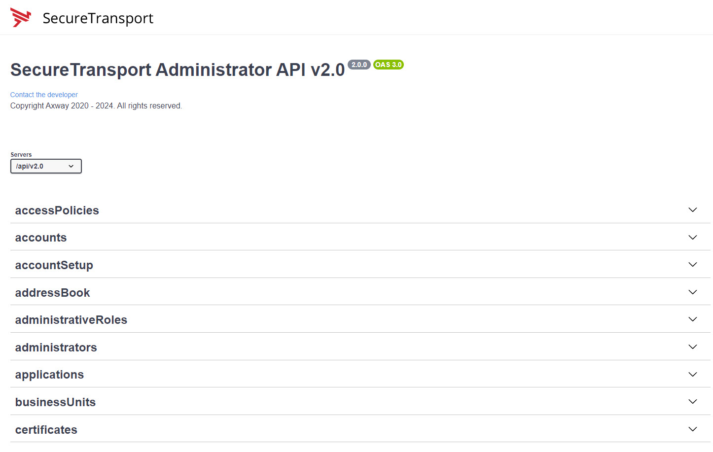
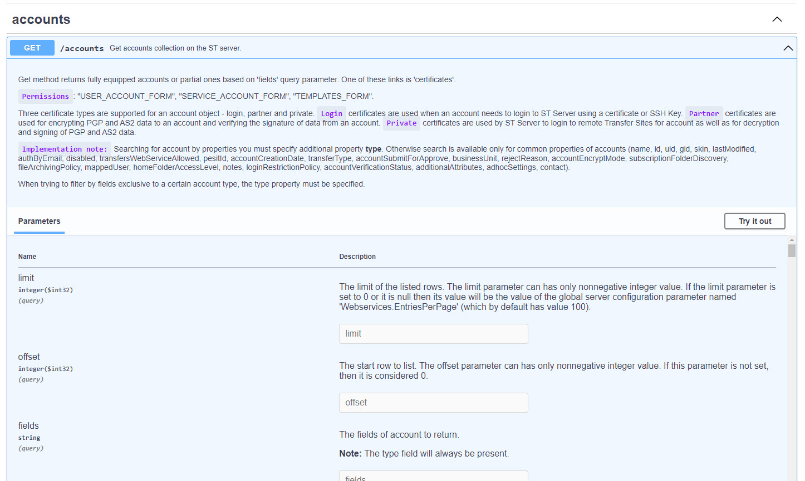

# SecureTransport-REST-API-Examples

> **These are examples, for test environments only.** Some of them change
> server configuration and stop or restart daemons and servers. Read the
> [Disclaimer](#disclaimer) before running anything.

## Table of Contents

1. [Introduction](#introduction)
2. [Disclaimer](#disclaimer)
3. [Axway University](#axway-university-training)
4. [Getting Started](#getting-started)
5. [Repository Layout](#repository-layout)
6. [Common Terminologies](#common-terminologies)
7. [OpenAPI](#openapi)
8. [HTTP Methods](#st-api-20-methods)
9. [What Is Covered](#what-is-covered)
10. [Features by Release](#features-by-release)
11. [License and Support](#license-and-support)

## Introduction
SecureTransport 5.5, released in June 2020, introduced REST API 2.0. The prior API release is version 1.4.
Currently supported APIs are V1.4 and V2.0 – both are available in ST release V5.5.

This github project looks at use cases from a specific viewpoint. Many clients and Axway themselves have implemented mechanisms to on-board clients and file transfer flows in an automated manner using APIs, rather than the alternative method of manual setups via the admin GUI of ST. Automation brings a reduced risk of introducing errors and also assists in adhering to any standards enforced by the owning institution in naming standards, security profiles etc.
Many other automation tasks such as certificate expiry monitoring, configuration drift from baseline, etc are all possible via API based scripts or programs.
 
The examples here use the `curl` command from bash, the same calls as Windows batch files, and the python scripting language. It should be pointed out that **ANY** language that supports HTTPS Restful APIs can be used. Please also note that the commands shown are not the sole method you might want to use. Feel free to simplify or extend further what is shown as a guideline and starting point.


## Disclaimer

**Everything in this repository is an example, for use on test environments
only.**

- The scripts show how to call the SecureTransport REST API. They are not
  production tooling. They are provided AS IS, with no warranty, and are not
  covered by Axway support or by any Axway service level agreement.
- Run them only against a test or lab environment. Never run them directly
  against production.
- Several examples change the server itself, not only test objects: they
  modify server configuration options, stop, start and restart daemons and
  servers, update transfer sites, routes and subscriptions in bulk, and
  create, change or delete accounts. Read each script, and understand the
  consequences of every change it makes, before you run it.
- Before you use any example, or anything you build from one, on a production
  system, test it yourself on a test environment first, and confirm it does
  exactly what you expect there.

## Axway University Training

Login to Axway University using your Axway ID

https://university.axway.com/

And then you can access the learning plan for the SecureTransport REST API

https://university.axway.com/learn/learning-plans/77/securetransport-apis

## Getting Started

### Start with the guides

Three short guides save you working this out for yourself:

- **[Orientation](.claude/skills/st-api-orientation/SKILL.md)** — what is here,
  how it is laid out, and which example covers which task.
- **[Gotchas](.claude/skills/st-api-gotchas/SKILL.md)** — the non-obvious traps in
  the API and in scripting against it, collected from real debugging. Worth
  reading before your first call.
- **[Adding an example](.claude/skills/st-api-add-example/SKILL.md)** — the house
  style, if you plan to contribute.

### Check your clone works

```
./tests/run_all.sh
```

Takes about 5 seconds, needs no server and no credentials. See the
[tests Quick Start](tests/README.md) for what it checks and how to add a test
with your change.

### Prerequisites

| Tool | Needed for | Notes |
| ---- | ---------- | ----- |
| `curl` | every bash and bat example | Included with Windows 10 and later. |
| `jq` | most bash examples | Used to read and edit JSON responses. |
| `python3` | the python examples | Plus the `requests` library: `python3 -m pip install requests` |
| `requests_toolbelt` | `python3/stGetPrivateCert.py` only | `python3 -m pip install requests_toolbelt` |
| PowerShell | the bat examples | Used in place of `jq` to read JSON. |

### Configuration

None of the examples contain a server address or credentials. Each group of
examples reads them from a file that you create once and that git ignores, so
your details are never committed.

The same four names are used everywhere, so there is one set to learn:

| Variable | Meaning |
| -------- | ------- |
| `ST_SERVER` | The SecureTransport host, without the protocol or port |
| `ST_PORT` | The API port. See the table below. |
| `ST_USER` | The account to authenticate as |
| `ST_PASSWORD` | That account's password, in plain text |

Copy the example file for the examples you want to run and edit your copy:

| Examples | Copy this | To this |
| -------- | --------- | ------- |
| `Admin/API 2.0/bash` | `set_variables.local.example.sh` | `set_variables.local.sh` |
| `Admin/API 2.0/bat` | `set_variables.local.example.bat` | `set_variables.local.bat` |
| `Admin/API 2.0/python` | `config.example` | `config` |
| `EndUser/API 2.0/bash` | `set_variables.local.example.sh` | `set_variables.local.sh` |

For example:

```
cd "Admin/API 2.0/bash"
cp set_variables.local.example.sh set_variables.local.sh
$EDITOR set_variables.local.sh
```

The scripts then pick your values up on their own. There is nothing to
configure inside the individual examples, and nothing to edit in the committed
`set_variables.sh`, `set_variables.bat` or `config.example` files.

The password is always entered in plain text. Where the API expects a base64
encoded `user:password` pair, the scripts derive it for you, so there is no need
to run `base64` by hand.

### Which port?

| Examples | Non root install | Root install |
| -------- | ---------------- | ------------ |
| Admin | 8444 | 444 |
| EndUser | 8443 | 443 |

### How much an example changes

Every example's header has a `Risk:` line, so you can tell before running it
what it may change on the server:

| Risk | Meaning |
| ---- | ------- |
| `read` | Changes nothing: a GET or HEAD, a login or logout, a connection test. |
| `write` | Creates, changes or deletes objects: accounts, sites, routes, policies. |
| `config` | Changes a server-wide setting. Put it back afterwards. |
| `disruptive` | Stops a service, or cannot easily be undone: daemon and server operations, maintenance mode, the keystore password. Run these only on a lab of your own. |

To list them all, with the endpoint each one calls:

```
python3 tools/list_examples.py --table     # or without --table, as JSON
```

### Running an example

Each example is self contained and can be run directly:

```
cd "Admin/API 2.0/bash/01.Authentication"
./01.myself_POST.sh
```

If the configuration is missing, the scripts stop with a message telling you
which file to create rather than failing part way through a request.

## Repository Layout

```
Admin/API 2.0/          Administrator API, on the admin port
    bash/               curl examples, numbered by topic
    bat/                the same examples for Windows
    python/
        python3/         the python examples
        utils/           tools that work on an exported configuration XML
EndUser/API 2.0/
    bash/               end user API, on the user port
Features/               complete solutions, one folder per feature
tools/                  list_examples.py: every example, its endpoint and Risk
images/                 screenshots used by this README
```

The bash and bat examples are numbered by topic and, within a topic, by HTTP
method, so `04.Applications/02.applications_POST.sh` is the POST example for
applications. Reading a topic folder in order walks you through the full
create, read, update and delete cycle for that object.

The python examples are different in character: rather than demonstrating a
single call, each one is a small complete program for a real task, such as
baselining the server configuration or bulk updating accounts.

## Common Terminologies

The following table shows a list of terms and acronyms used throughout this project.

| Definition | Description |
| ---------- | ----------- |
| API | Application Programming Interface |
| CRUDL | Create Read Update Delete List |
| HTTPS | Hypertext Transfer Protocol Secure |
| JSON | JavaScript Object Notation |
| MFT | Managed File Transfer |
| PGP | Pretty Good Privacy |
| ReST | Representational State Transfer |
| SaaS | Solution as a Service |
| SFTP | SSH File Transfer Protocol |
| ST | SecureTransport |
| TLS | Transport Layer Security |
| UI | User Interface |
| XML | eXtensible Markup Language |

## OpenAPI

SecureTransport provides an Open API (a.k.a. Swagger UI) which allows you to interactively explore its APIs.

In any browser enter as below, substituting your server’s IP and port used for the admin GUI. For example the default for a non root install would be: https://<<SERVER_IP>>:8444/api/v2.0/docs/index.html for version 2.0 or https://<<SERVER_IP>>:8444/api/v1.4/docs/index.html for version 1.4.

The above URLs all provide access to the ADMIN level APIS.  There is a smaller set of user level APIs available at the 8443 or 443 port.

You will be required to authenticate with an administrator username and password. Once authenticated, a screen as below will be seen.



Expanding any of the arrows will display the respective APIs along with available methods.

Selecting the GET /accounts for example will then open a window as below indicating all the possible parameters that might be used to select accounts from the system. Be careful of any API that is not a read or GET method.  PUTs, POSTs, DELETEs will all work if you enter the correct parameters and input data.



Note the ‘Try it out’ button. Select the button and you will now be able to use this API live.

The Open API provides a curl command equivalent that it is using to fetch the data. Notice also that a server response will be displayed showing the returned JSON data.

The HTTP success code of 200 is shown next to the response assuming all worked correctly. Finally, if you wish to download the response there is an option to download the output json to your PC.

By default, the system will only return up to (by default) 100 objects. This value can be changed via the Server Configuration Option Webservices.EntriesPerPage.


## ST API 2.0 Methods

When designing a RESTful API, it's crucial to use HTTP methods correctly to ensure clarity and consistency in your API's behavior. Here's a brief overview of the commonly used HTTP methods and their appropriate usage:

**GET**: Use GET to retrieve resource representations without modifying the server's state. It's safe and idempotent, meaning repeated requests should yield the same result.

**POST**: Employ POST to create new resources. The server assigns a unique identifier to the newly created resource. POST is not idempotent, as multiple identical requests may result in multiple resource creations.

**PUT**: Use PUT to update existing resources by replacing their entire content. It's idempotent, as repeated requests should have the same effect as a single request.

**PATCH**: Apply PATCH for partial updates to existing resources. It's more efficient than PUT when only a few fields need to be updated in a large resource.

**DELETE**: Utilize DELETE to remove resources from the server. It's idempotent, as the result remains the same whether you delete a resource once or multiple times. 
*Note*: The DELETE method is considered idempotent despite potentially returning different responses because idempotency in REST APIs focuses on the server-side effect rather than the client-side response.

**HEAD**: Similar to GET, but only retrieves headers without the response body. Use it to check resource metadata or determine the size of a potential GET response.


## What Is Covered

This project is a work in progress. The tables below describe what is in the
repository today, so that you can see at a glance whether the example you need
already exists.

### Admin API

| Topic | Endpoints | bash | bat |
| ----- | --------- | :--: | :-: |
| 01. Authentication | `/myself`, basic auth and cookie jar | 2 | 2 |
| 02. Introduction | `/version`, `/myself` | 6 | 6 |
| 03. Connect | `/daemons`, `/servers`, and their operations | 13 | 13 |
| 04. Applications | `/applications`, flow and maintenance types | 7 | 7 |
| 05. Accounts | `/accounts`, including PATCH from a file | 8 | 8 |
| 06. Transfer Sites | `/sites`, HTTP and SSH pull and push sites, list, delete by id | 4 | 4 |
| 07. Subscriptions | `/subscriptions`, Advanced Routing, with and without a trigger file, delete by id | 4 | 4 |
| 08. Route Templates | `/routes`, template type | 1 | 1 |
| 09. Composite Routes | `/routes`, composite and simple types, Compress and Decompress steps, linked to a subscription, list, check, replace, patch a step, delete by id | 9 | 9 |
| 11. Certificates | `/certificates`, generate, import, export, signing requests | 14 | 14 |
| 12. Business Units | `/businessUnits`, units, their nesting, and why a delete is refused | 7 | 7 |
| 13. Configurations | `/configurations`: options, logging, database, Sentinel, login, archiving, external stores, S3 storage profiles | 47 | 47 |
| 15. Transfers | `/transfers/operations`, a pull on demand | 1 | 1 |
| 16. Transfer Logs | `/logs/transfers`, by account and status, billable transfers per day | 5 | 5 |
| 17. Access Policies | `/accessPolicies`, the embedded database's pg_hba.conf rules | 6 | 6 |
| 18. Account Setup | `/accountSetup`, an account with its sites, profiles and subscriptions in one call | 4 | 4 |
| 19. Address Book | `/addressBook/sources`, where end users' address books look people up | 5 | 5 |
| 20. Administrative Roles | `/administrativeRoles`, the roles and the menus they open | 7 | 7 |
| 21. Administrators | `/administrators`, administrators, locking them, and their API keys | 10 | 10 |
| 22. Denied Users | `/deniedUsers`, login names that may not log in, for good or for hours | 3 | 3 |
| 23. Events | `/events`, the tasks being processed now: list, read, delete a stuck one | 3 | 3 |
| 24. ICAP Servers | `/icapServers`, antivirus and DLP scan servers: add, change, switch on and off, and what a scan does to a transfer | 7 | 7 |
| 25. LDAP Domains | `/ldapDomains`, directories users can be looked up in: add, change, remove, and test a connection | 8 | 8 |
| 26. Login Restriction Policies | `/loginRestrictionPolicies`, rules that allow or deny logins by address: policies, rules, business units | 9 | 9 |
| 27. Audit Logs | `/logs/audit`, who changed what, and when: list, read, a refused edit, CSV export | 4 | 4 |
| 28. Server Logs | `/logs/server`, what the servers wrote: search, read, CSV export | 3 | 3 |
| 29. Mail Templates | `/mailTemplates`, the XHTML files the notification e-mails are built from: list, add, replace, read, delete | 6 | 6 |
| 90. End To End Acknowledgment | `/logs/transfers`, PeSIT ACK and NACK | 2 | 2 |

Every bash example has a bat equivalent, so Windows users can follow the same
path through the material. Where the bash examples use `jq`, the bat examples
use PowerShell to do the same job.

### EndUser API

| Topic | Endpoints | bash |
| ----- | --------- | :--: |
| 01. Authenticate | `/myself`, login and logout | 2 |
| 02. Files | `/files` and `/fileOperations`: list, with paging, sorting, metadata and glob patterns; create a folder; upload, with an MD5 check; download; rename; share and unshare; delete | 15 |
| 03. Myself | `/myself`, `/myself/password`, `/myself/passwordExpired`, `/myself/secretQuestion`, `/secretQuestions`, `/myself/addressBook`: the account, password change and reset, secret questions, the address book | 10 |
| 04. File Operations | `/fileOperations`: MD5 checksum, an operation's state, chunked and multipart uploads, cancel | 5 |
| 05. Transfers | `/transfers`, `/transfers/operations`, `/transfers/pullSummary`: the user's transfer log, pull, push, folder monitor, pull summary, AS2 receipt check | 7 |
| 06. Server Time | `/serverTime` | 1 |

Every resource of the EndUser API 2.0 reference has an example. All of them
were run against a real server except three, which say so in their own header:
the password reset pair (`03.Myself/04` and `05`), which need a real reset
email, and `05.Transfers/07`, which needs an AS2 transfer.

Where the EndUser API behaves differently from what you might expect,
confirmed against a real server:

- **Writes do not need the `csrfToken`.** The login answers with one, but a
  POST, PUT, PATCH or DELETE succeeds without it: the session cookie is enough.
- **Changing the password ends the session.** The next call with the same
  cookie answers 401. Log in again with the new password, as
  `03.Myself/03.myself_password_POST_change.sh` does.
- **`/transfers` returns a plain list**, not the `{resultSet, result}` envelope
  the Admin API uses. So do `/myself/addressBook` and `/secretQuestions`.
- **A wrong `Content-MD5` gives a bare 500**, "Error while uploading file", with
  no word about the checksum. File Tracking logs the upload as Failed.
- **A file operation's status describes the operation, not the file.** An
  Upload stays `IN_PROGRESS` after its last chunk, though the file is whole.
  Check the file itself, with `02.Files/10.files_filepath_GET_metadata.sh`.
- **`/serverTime` writes the offset as `+0300`**, not with the `Z` the API
  reference shows. Parse the offset, as `06.ServerTime/01.serverTime_GET.sh` does.

### Python

The python examples are whole programs for real maintenance tasks, rather than
single calls. They are CSRF aware, as required from the 20230525 release onwards.

| Script | What it does |
| ------ | ------------ |
| `stBuildFullTestAccount.py` | Onboards one account end to end: account, certificate, transfer site, routes and subscription. The best place to start if you are automating onboarding. |
| `stBuildTestAccounts.py` | Creates accounts in bulk, using multiprocessing. |
| `stDeleteTestAccounts.py` | Deletes accounts in bulk. |
| `stGetAccountsAfterDate.py` | Lists accounts created after a given date. |
| `stUpdateAllAccounts.py` | Scans every template account and updates a field. Uses certificate based authentication rather than basic auth. |
| `stUpdateAllRoutes.py` | Scans every simple route and patches a field on the route, or a field inside one of its steps. |
| `stUpdateRouteWithPut.py` | Reads a route, changes it and writes the whole object back. Inserts steps, links a simple route into a composite, or attaches a route to a subscription. |
| `stUpdateAllSubscriptions.py` | Scans every subscription and patches a set of fields. |
| `stUsersPerSharedFolder.py` | Reports which accounts have access to each shared folder, by joining applications and subscriptions. Read only. |
| `stReplaceSites.py` | Scans SSH transfer sites and updates their cipher suites. |
| `stCertificateExpiry.py` | Counts the certificates and reports the ones that have expired or are about to. Read only. |
| `stBillableTransfers.py` | Counts the billable transfers per day, for every account or for one. Needs 5.5-20260924 or later. Read only. |
| `stGetPrivateCert.py` | Exports a certificate by ID. Needs `requests_toolbelt`. |
| `stAddLoginRestrictionRule.py` | Adds a rule to an existing login restriction policy. |
| `stConfigScan.py` | Baselines the server configuration and reports drift from the baseline on later runs. Useful after a patch. |
| `stGraceful.py` | Gracefully drains and shuts down a core and edge pair. |

The three scripts that change many objects at once — `stUpdateAllRoutes.py`,
`stUpdateAllSubscriptions.py` and `stUpdateRouteWithPut.py` — have a `dryRun`
setting in their configuration section, which is on by default. Run them that
way first and read the output before letting them write.

`utils` holds two tools whose input is an exported `systemConfiguration.xml`
rather than the live API:

| Script | What it does |
| ------ | ------------ |
| `stCompareExportedConfigurations.py` | Compares two exported configurations and reports the options whose value differs, and the options present in only one of them. Useful when you have the exports but no access to the system. |
| `processSystemConfig.py` | Extracts the user classes from an export and converts their membership expressions from the 5.2.1 format to the 5.5 format. Writes the result as XML, and can create the user classes on a target server through the API when `createOnTarget` is set. |

Export the configuration from the GUI, then take the XML out of the zip it
produces:

```
unzip -j export_configuration.zip systemConfiguration.xml -d /home/axway/api
```

### Not yet covered

These areas of the API do not have examples yet. Contributions are welcome, and
the list doubles as a rough roadmap.

- Mail Templates, Sessions, Statistics Summary and Zones
- Transfer Profiles, Route Steps Charsets and Route Steps Metadata
- Site Templates and User Classes
- The Transaction Manager
- Cluster Services (not planned: the examples are written against a standalone server)

Some areas are covered by the python examples but not yet by bash or bat:
changing routes and subscriptions that already exist, and the transaction
manager. See the python table above.

## Features by Release

New SecureTransport releases add features that are easier to learn as a complete
solution than as a list of API calls. Those live in [Features](Features/), one
folder per feature, with the same examples in bash and as Windows batch files.

The folders are organised by feature, so that a feature is easy to find. The
[Features index](Features/README.md) lists them grouped by the release that
introduced them, so you can see which ones your version supports. Every script
also checks the server version with `GET /version` before it does anything, and
skips itself on a release that is too old.

| Release | Feature |
| ------- | ------- |
| 5.5-20260924 | [Trigger route execution after a completed pull operation](Features/trigger-route-after-completed-pull/) |
| 5.5-20260924 | [Audit and report on billable transfers](Features/audit-billable-transfers/) |

## License and Support

These examples are published under the Apache License 2.0. See [LICENSE](LICENSE).

The included software is provided AS IS, with no implied or expressed warranty,
and is not covered by any Axway service level agreement. It is intended to
illustrate the API rather than to be run unmodified against a production
system. Take a backup before running anything that writes, and test the result
afterwards. Note in particular that several examples create, modify or delete
objects, and that `python3/stDeleteTestAccounts.py` deletes accounts in bulk.